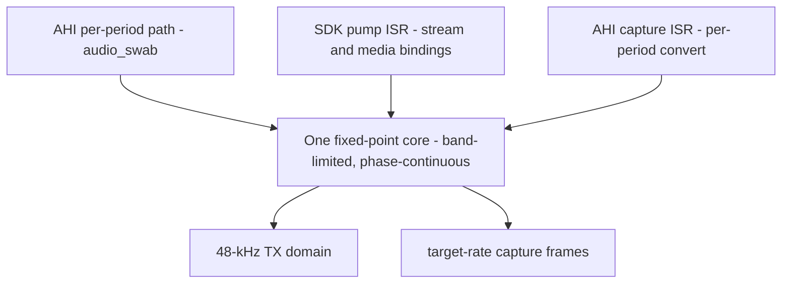
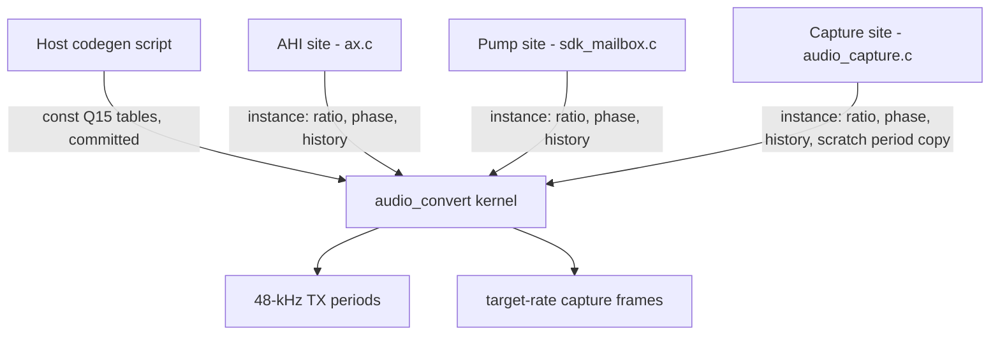
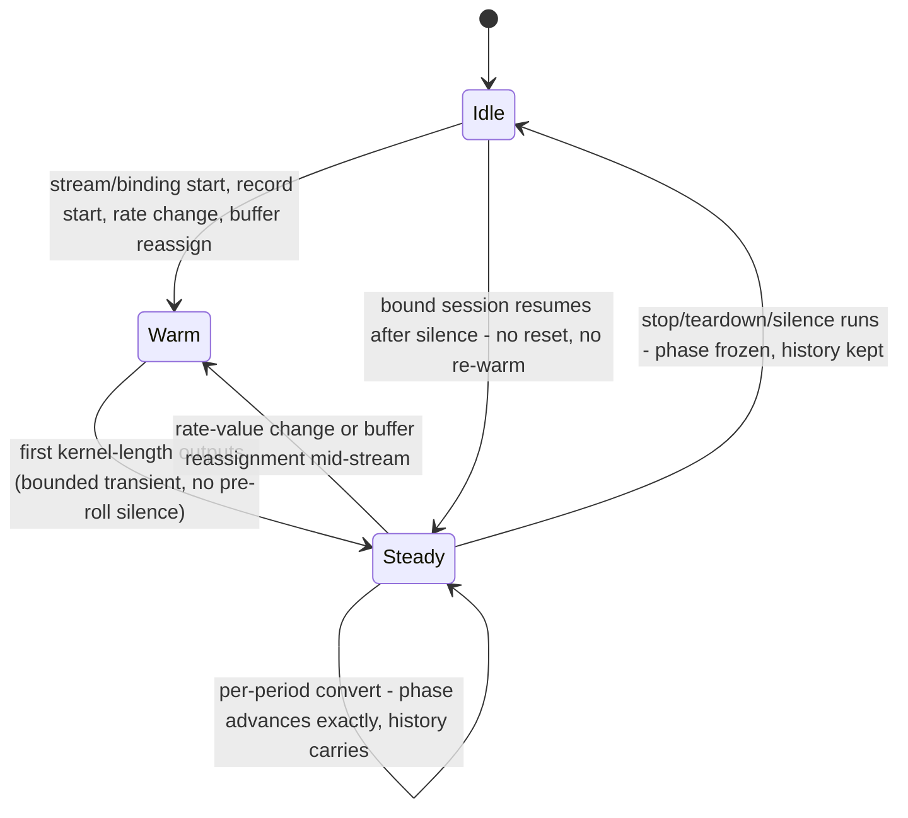

## Goal Capsule

- **Objective:** All audio crossing the ZZ9000AX's fixed 48-kHz domain converts through one qualified, band-limited, fixed-point core with published, test-gated measurements — no per-path rate quirks remain.
- **Means:** Replace the three legacy linear converters (playback resampler, ISR pump mirror, capture conversion) with the shared core; keep every surrounding behavior contract.
- **Product authority:** 2026-08-21 brainstorm session (user), seeded by the AmiGUS feature assessment (external handover artifact `24-zz9000ax-amigus-feature-assessment.html` in the ZZ9000 handover folder, direction I2). The assessment's other directions are not active scope.
- **Open blockers:** none.

---

## Product Contract

Product Contract preservation: restructured, no scope change — the Outstanding Questions section (all items were Deferred to Planning) is resolved into Planning Contract KTD1–KTD7; Requirements, Acceptance Examples, Key Decisions, and Scope Boundaries are unchanged, with one new plan-local `Deferred to Follow-Up Work` subsection.

### Summary

One qualified, band-limited, fixed-point 48-kHz conversion core replaces all three current conversion sites — AHI playback, decoded-stream output via the SDK pump, and AHI capture. Truncation drift and unfiltered linear interpolation are gone, host-buildable tests gate the change, and the measured numbers are published; real hardware gets a smoke check only.

### Problem Frame

The card's output domain is fixed: the ADAU1701 link is a qualified 48-kHz/16-bit TDM8 contract, and every non-48-kHz source must cross into it in firmware. Three unfiltered linear converters do that crossing today, and they diverge. The playback resampler is double-based linear interpolation flagged `FIXME missing filter, wonky address calculation` (`ZZ9000_proto.sdk/ZZ9000OS/src/ax.c:969`). The SDK pump's ISR mirror reproduces it in fixed point "including its quirks" — deliberately retaining its truncation drift (`ZZ9000_proto.sdk/ZZ9000OS/src/sdk_mailbox.c:3748`). Capture does a per-period linear downsample with no anti-aliasing (`ZZ9000_proto.sdk/ZZ9000OS/src/audio_capture.c:33`).

Nothing user-visible has broken: no reports of aliasing or wrong-pitch playback are on record. The cost is structural. Every future audio direction from the seed assessment — concurrent sources, tracker voices, new codecs — lands on this boundary, and three hand-matched implementations are exactly how per-path rate quirks accumulate; the mirror exists only because the main loop uses arithmetic an ISR cannot. The value of fixing it is architectural first, audible second, which is why the measurable before/after evidence is part of the deliverable rather than an afterthought.

### Key Decisions

- **All current conversion sites unify now** — one boundary every path inherits (session-settled: user-directed — chosen over playback-only or playback+capture cuts: no per-path rate quirks survive). Governs R1.
- **Clean break on the capture contract** — new behavior documented as the contract (session-settled: user-directed — chosen over capability gating, capture deferral, or measure-then-decide: simplest matched set). Governs R5, R6.
- **Host-buildable tests are the acceptance gate** — hardware gets a smoke check only (session-settled: user-directed — chosen over on-hardware sign-off or tests-plus-hardware-run: fastest gate that still publishes measurable value). Governs R10, R11.
- **One shared integer fixed-point core at every site** — the main-loop playback path gives up double precision so host tests exercise the exact production arithmetic everywhere (session-settled: user-approved — surfaced as a synthesis call-out with the double-precision tradeoff visible; user confirmed). Governs R2, R7.

- **Drift removal is intended behavior** — correct pitch replaces the mirror's truncation drift; nothing known depends on the drifted rate (session-settled: user-directed — chosen over treating MHI sync or tracker timing as blockers: no known dependents). Governs R4.
- **No new advertised capabilities** — the reserved `resample` opcode and flag stay reserved; SDK docs gate advertising on real-hardware testing outside this scope (session-settled: user-approved — proposed in the synthesis scope-out; user confirmed).

<!-- ce-section: work-relationships -->
### How This Work Fits Together

This plan owns the qualified fixed-48-kHz conversion path (assessment direction I2). The surrounding assessment areas are the current understanding, not a committed roadmap:

- I1 Audio Fabric — Depends on this plan's single conversion boundary; defines producers and leases later.
- I3 Audio Control Plane — Can proceed independently of this plan; shares the fixed output domain.
- I4 Tracker Accelerator — Later; renders voices into PCM that crosses this plan's boundary.
- I5 Codec-neutral backend registry — Can proceed independently; architectural until codec demand.
- Still to decide: sequencing among I3, I4, and I5 after this plan lands.

### Requirements

**Conversion core**

- R1. Every rate conversion between a non-48-kHz source and the card's fixed 48-kHz output domain runs through one shared converter core with identical arithmetic at every site: AHI playback (per-period path), decoded-stream output (SDK pump, stream and media bindings), and AHI capture (receive conversion).
- R2. The core is integer-only fixed-point and safe unchanged in interrupt context on either ARM core; no site uses floating point.
- R3. Conversion is phase-continuous across periods and band-limited: interpolation images and decimation aliases are suppressed to a published attenuation target, replacing unfiltered linear interpolation.
- R4. Streaming playback is drift-free at correct pitch over long runs; removing the legacy truncation drift is intended behavior, not a regression.

**Capture contract**

- R5. Capture preserves its exact per-period geometry: every advertised rate yields an exact integer frame count per 20-ms period (160/240/480/640/882/960 at 8/12/24/32/44.1/48 kHz) on the 8-period × 3840-byte ring, with sequence publication and seven-immutable-periods semantics.
- R6. The capture contract change ships as a clean break: edge sample values and quality change under the new core, the matched recording docs state the new behavior, and no version negotiation or legacy conversion path is retained.
- R7. Each stream owns a private core instance; no conversion state is shared between streams, sites, or directions.

**Preserved invariants**

- R8. Behaviors around conversion are unchanged: mono-to-stereo duplication, silence on underrun, fault, or unusable geometry, BUSY ownership answers and single-writer frontier semantics, refill and backpressure geometry, generation-safe teardown, and exact 20-ms period timing.
- R9. The pump ISR and capture ISR complete their period work within the existing deadline envelope at every advertised rate, with the per-sample cost and margin documented from the core's design.

**Qualification and publication**

- R10. The host test suite in `test/audio` gates the work: per rate, in the core's own fixed-point arithmetic, it verifies passband and stop-band attenuation against the published target, THD, impulse and DC behavior, drift-free long-run timing, and capture's exact per-period counts.
- R11. Measured passband, stop-band attenuation, latency (group delay), clipping and headroom behavior, and cycle cost are published in the matched docs; card-side cycle cost is labeled a host-measured estimate until a separate on-hardware run exists.

Key Flows are omitted: conversion replaces an internal step of three existing flows without changing any observable sequence; the sites are enumerated in R1 and pointed to in Sources.

### Acceptance Examples

- AE1. **Covers R3, R4.** Given a 44.1-kHz stereo source streamed for thousands of periods through the pump, when playback completes, then output pitch shows no accumulated drift and stop-band energy stays below the published target.
- AE2. **Covers R1, R2.** Given identical source bytes at 24 kHz fed through the AHI per-period path and the pump path, when both convert, then the outputs are bit-identical.
- AE3. **Covers R5.** Given capture at 44.1 kHz, when each period publishes, then it contains exactly 882 frames and overrun still delivers only the newest seven periods in chronological order.
- AE4. **Covers R8.** Given a bound pump session starved mid-stream at 12 kHz, when the ring drains, then the pump emits whole silence periods with today's semantics — no partial periods, no new failure mode.
- AE5. **Covers R10.** Given the converter core merged, when `make test` runs in `test/audio`, then every converter test passes at all six rates and a failing test blocks the change.

### Success Criteria

- Exactly one rate-conversion implementation remains in the firmware tree; the legacy `resample_s16`, `pump_resample_s16`, and `zz_audio_capture_convert` linear converters and their FIXME markers are gone.
- A published per-rate numbers table (passband, stop-band attenuation, group delay, headroom, cycle cost) exists in the matched docs.
- The host suite runs green from a clean checkout via the existing `test/audio` Makefile.

### Scope Boundaries

**Deferred for later**

- Audio fabric multi-source mixing (I1), control plane with metering and DSP profile catalog (I3), tracker/voice service (I4), codec backend registry and new codecs (I5) — each inherits this converter.
- Advertising the reserved `resample` capability: the opcode and flag exist and stay unadvertised; SDK docs require real-hardware testing first.
- On-hardware qualification run (loopback spectrum, measured cycle counts); this scope smoke-checks only.

**Outside this product's identity**

- New rates or formats (96/192-kHz, 24-bit) — rejected by the seed assessment; the qualified frontier stays 48-kHz/16-bit.
- Host-side (Amiga driver) conversion as an alternative boundary.
- ADAU1701 image, DSP profile, or bitstream changes — the production profile and its hash identity are untouched.

**Deferred to Follow-Up Work**

- `BUILD.md` Tests section lists only `test/rtg` and `test/video` and omits `test/audio` (and the other CI suites) — adjacent doc rot, not this plan's deliverable.
- Stale code comment `byteswap, resample and play buffer` in `zz9000-drivers/ahi/driver/zz9000ax-ahi.c:462` — cosmetic, drivers repo.

### Dependencies / Assumptions

- Assumption: nothing observable depends on today's conversion values or drifted timing; no known dependents exist (MHI re-syncs from PTS). The docs still state the change explicitly.
- Assumption: the six-rate set stays fixed (driver frequency table in `zz9000-drivers/ahi/driver/zz9000ax-ahi.c`); new rates are out of scope.
- Dependency: matched-stack doc updates span the firmware recording docs and the `zz9000-drivers` recording spec; SDK library docs only if wording references conversion behavior.

### Sources / Research

- `ZZ9000_proto.sdk/ZZ9000OS/src/ax.c:969-1019` — legacy playback resampler, verbatim FIXME markers, clamp hack, cross-period double state; `ax.c:835-896` — receive ISR with conversion between cache invalidate and flush.
- `ZZ9000_proto.sdk/ZZ9000OS/src/sdk_mailbox.c:3692-3709` — pump architecture (integer-only ISR, no VFP state across interrupts, mono duplication, silence semantics); `sdk_mailbox.c:3748-3821` — fixed-point mirror with deliberate truncation drift; `sdk_mailbox.c:3988-3993` — the single pump rate-gate, serving both stream and media bindings.
- `ZZ9000_proto.sdk/ZZ9000OS/src/audio_capture.c:33-68` — per-period integer linear capture conversion; `audio_capture.h:13-15` — 960-frame input, 8-period ring, 7 resident periods.
- `test/audio/Makefile` — host-buildable suite (`make test`, `cc`, `-Werror`), the harness R10 builds on; per-test targets compile the exact firmware sources under test, which enforces BSP-free modules.
- `zz9000-drivers/docs/ahi-recording-spec.md:147-190` — ring geometry, the six advertised rates, exact 20-ms periods, integer-ISR rules, seven-immutable-periods semantics, and the 1–960 register-value contract.
- `zz9000-sdk/docs/zz9k-library.md:754-758` — capability-advertising rule gating flags on real-hardware testing.
- `zz9000-sdk/docs/zzplay.md:57-86` — backends (AHI/MHI/AX), one-owner BUSY semantics for decoded-stream output.
- `zz9000ax/README.md:25-41` — single hash-pinned production DSP image, untouched by this plan.
- Seed assessment: `24-zz9000ax-amigus-feature-assessment.html` — external handover artifact in the ZZ9000 handover folder, not committed to any repo (direction I2 and the non-negotiable constraint list).
- Grounding dossier (extraction-only, all 11 load-bearing claims verifier-confirmed 2026-08-21): session scratch artifact under the OS temp `compound-engineering-197608/ce-brainstorm/zz9000ax-amigus-20260821/grounding.md`.
- External resampler-design research (2026-08-21, load-bearing for KTD1–KTD3): speexdsp `resample.c` (exact-rational phase loop, direct-vs-oversampled tables, saturating fixed-point MAC, `skip_zeros`/`reset_mem`); openal-soft `polyphase_resampler.cpp` (Kaiser sizing); soxr (passband_end 0.913, TPDF-for-INT16 default, clip counter); libsamplerate quality ladder; J.O. Smith, *Digital Audio Resampling* (CCRMA) — min-cutoff rule, reconstruction overshoot; Crochiere & Rabiner, *Multirate Digital Signal Processing*; AES17 THD+N measurement (997-Hz convention).

---

## Planning Contract

### Key Technical Decisions

- KTD1. **Windowed-sinc polyphase FIR, one coefficient bank per ratio-pair, direct phase tables committed as `const` Q15 arrays.** Coefficients are generated offline by a host codegen script (per-phase tap-sum unity and L1-norm overflow safety asserted at generation time), never at runtime — this is what makes host-test arithmetic identical to target arithmetic (R1, R2, R10). Farrow/cubic is the lowest quality tier in production resamplers and stays out; cascade/halfband only pays off beyond this plan's ≤6:1 ratios. Direct tables cost ~64 KB worst case (the 44.1-kHz pair: ~160×100 + ~147×110 Q15 coefficients from the Kaiser relation at KTD3's targets; exact size asserted by the codegen) and keep one MAC per tap (session-settled: user-approved — chosen over compressed oversampled tables (~4 KB, extra arithmetic per tap): simplicity and one-MAC-per-tap beat the memory saving). Conflict note: the sizing evidence at settlement (~20 KB) was understated; the corrected estimate is ~64 KB and a 32 KB bank exceeds L1 data cache. Decision reaffirmed against the firmware image budget; oversampled compression remains the documented fallback if codegen-measured size or L1 pressure argues otherwise. Governs R1, R2, R3.
- KTD2. **Exact-rational integer phase: `pos_int += num/den; pos_frac += num%den; carry` — no binary fixed-point step accumulator.** 147/160 (44.1 kHz) is not representable in any binary fixed-point format; a 16.16 step accumulator is precisely the legacy mirror's drift bug class (R4) (session-settled: user-directed — instantiates the drift-removal Key Decision, chosen over retaining approximation: exact integers are the same cost). Governs R4.
- KTD3. **Published targets: passband ripple ≤ 0.1 dB up to 0.45 × min(fs_in, fs_out), stop-band ≥ 80 dB, group delay (kernel length in input samples, from one causal delayed-symmetric kernel used at every site) published per rate; no dither.** 80 dB is transparent for 16-bit I/O; the kernel length is sized by the Kaiser relation to hit it. No dither matches today's requantization behavior and keeps silence bit-silent; TPDF is a documented follow-up if low-level THD+N tests miss target (session-settled: user-approved — chosen over TPDF by default: no audible-regression risk in the retrofit). Governs R3, R10, R11.
- KTD4. **Site semantics: exact-consumption streaming and exact-count capture.** The pump-side core consumes exactly `rate/50` source frames per 20-ms period and carries filter history internally with no look-ahead into the next pull, so `period_source_bytes` bookkeeping, FEED backpressure, and tail drain stay bit-for-bit unchanged. The capture side copies each completed 3840-byte DMA period to a CPU-side scratch buffer and converts scratch-to-period — in-place conversion is impossible with a long kernel, where early outputs overwrite inputs that later outputs still read (~70% of frames at 44.1 kHz). One causal delayed-symmetric kernel (backward history only) serves every site; filter history crosses periods in the instance, and because every advertised ratio consumes 960 input frames to an exact integer output count, the exact-rational phase lands on a period boundary naturally — exact counts with no per-period state reset. 48-kHz sources are byte-identical passthrough at every site (capture: endian swap only). Governs R4, R5, R8.
- KTD5. **Converter state resets only on: playback stream/binding start, AHI rate change detected per call, capture record start, capture frame-count value change, or buffer reassignment — never on routine per-period register writes.** The AHI driver writes the capture frame-count register on every playback period; resetting on write would re-zero the filter 50×/s during full-duplex and never reach steady state. Same-value writes are no-ops (session-settled: user-approved — chosen over reset-on-any-register-write: full-duplex recording must reach steady state). Governs R3, R5, R7, R8.
- KTD6. **Off-table capture frame counts (register allows 1–960) fall back to 48-kHz identity conversion, with the register contract wording updated to name the six supported counts.** No shipping client writes off-table values; a general rational engine would multiply the qualification surface for zero known users (session-settled: user-approved — chosen over a general rational-ratio engine: fallback matches today's invalid-value behavior at one-tenth the surface). Governs R5, R6.
- KTD7. **Deadline envelope: no observable DMA overrun or underrun at any advertised rate under full-duplex worst-case bursts (pump refill after overrun rebase plus capture burst), proven by analytic cycle estimate published with the numbers.** Worst case ≈ 2.5M MAC per 20-ms window (≈ 6 pump + 7 capture periods; capture decimation pays the full input-rate kernel per output — ~1.35M at 8 kHz alone); at the card's 666.67 MHz that is roughly 20–40% of the 13.33M-cycle window with the Cortex-A9's native dual 16×16→32 MAC (SMLAD) — real margin, not comfortable headroom. Capping conversions per ISR is the documented fallback keyed to this estimate, trading publication latency (session-settled: user-approved — chosen over burst-capping by default: bursts are today's behavior and stay unless proven unsafe). Governs R9, R11.

### High-Level Technical Design

One BSP-free module — `audio_convert.c` / `audio_convert.h`, following the `audio_capture.{c,h}` pattern (`zz_audio_` API prefix, `<stdint.h>`-only header, no BSP includes) — owns all conversion arithmetic. Each site holds a private instance struct (ratio table pointer, integer phase, per-channel history, clip counter) and calls the same kernel; site glue (rate derivation, mono duplication, silence, cache maintenance) stays thin in `ax.c` / `sdk_mailbox.c` / `audio_capture.c`.

Instance lifecycle — reset is one atomic event that clears phase, history, and clip count together (partial resets click and jump pitch):

### System-Wide Impact

- ISR timing envelope: the core costs more per sample than two-tap linear; the pump and capture ISRs share the 20-ms window with all other work. KTD7's published estimate is the guardrail, and the silence path bypasses the kernel entirely.
- Matched release set: firmware carries the core and both doc rewrites land with it (firmware protocol doc + drivers spec); the SDK needs no change (capability flags stay reserved).
- Zorro II window: no new host-visible state, buffers, or registers; the converter and its tables live entirely in card-resident firmware memory.

### Risks

- **ISR deadline under full-duplex bursts** — mitigated by KTD7's corrected analytic estimate (~2.5M MAC worst case, ~20–40% of the window at 666.67 MHz) with SMLAD; fallback is per-ISR conversion capping keyed to that estimate.
- **44.1-kHz table size (~64 KB const pair)** — acceptable against the card's firmware image budget, but a 32 KB bank exceeds L1 data cache and is priced into KTD7's cycle estimate; oversampled compression is the documented fallback (KTD1).
- **Capture buffer correctness** — the scratch-copy conversion is unit-tested with impulses at both the first and last input frames of a period (early-period energy and cross-period continuity).
- **Host–target divergence** — impossible by construction: one kernel, one committed table set, integer-only arithmetic compiled identically on host and target (AE2 proven by delegation, since the call sites themselves are not host-compilable).

### Sequencing

The core, tables, and host suite land first and gate everything (U1); the three site cutovers (U2–U4) are then small verifications against the already-gated core, with 44.1-kHz — the only multi-phase-heavy ratio — qualified inside the host suite before any site switches; measurements and matched docs close (U5–U6) as release closure, not as a technical dependency of the measurements.

---

## Implementation Units

### U1. Converter core, coefficient tables, and host suite

- **Goal:** The shared conversion kernel exists, compiles host and target, and carries the full host test battery at all six rates.
- **Requirements:** R1, R2, R3, R4, R7, R10 (AE1, AE2, AE5).
- **Dependencies:** none.
- **Files:** `ZZ9000_proto.sdk/ZZ9000OS/src/audio_convert.c` (new), `ZZ9000_proto.sdk/ZZ9000OS/src/audio_convert.h` (new), generated table source (new), host codegen script (new, under `util/` following the `compare_ps7_tables.py` host-script precedent), `ZZ9000_proto.sdk/ZZ9000OS/Makefile` (add to `C_SRCS` — without this the module never ships in the ELF), `test/audio/Makefile` (new test target), `test/audio/audio_convert_test.c` (new).
- **Approach:**
  1. Codegen script emits one `const` Q15 bank per ratio-pair (1/6, 1/4, 1/2, 2/3, 147/160, both directions) plus 48-kHz identity; it asserts per-phase tap-sum unity and int32-accumulator L1 safety, and fails on violation.
  2. Kernel implements KTD2's exact-rational phase and KTD4's two modes: streaming (exact `rate/50` consumption, history carried, no look-ahead) and capture (exact output count; converts from a scratch copy of the completed period).
  3. Exit sequence per sample: int32 MAC accumulate, add half-LSB, shift, saturate to int16, count clips (KTD1, KTD3).
  4. Instance API: init/reset (one atomic event per KTD5), process. Mono duplication stays at call sites (duplicate-before-convert, one phase clock per frame).
- **Execution note:** Implement test-first — the host suite is the acceptance gate (R10), so the tests are the product; land kernel and suite together.
- **Patterns to follow:** `audio_capture.{c,h}` module separation; `audio_capture_test.c` fixture/assert idiom (deterministic integer inputs, hand-derived expected values with the math in comments); `test/audio/Makefile` per-test target rules.
- **Test scenarios:**
  - DC and step inputs at several levels including ±full-scale: output constant within ±2 LSB (catches per-phase tap-sum and rounding bias).
  - Impulse through each phase branch per rate: measured (quantized-table) passband ripple ≤ 0.1 dB to 0.45 × min(fs), stop-band ≥ 80 dB.
  - Alias rejection: tone above output Nyquist at each capture rate; in-band residual below target (a passband sweep alone does not test this).
  - Upsampling image check: two-tone input at 8/12/24/32 kHz; images below target.
  - THD+N at 997 Hz (AES17 coherent sampling): near-full-scale and −60 dBFS inputs meet target.
  - Cross-period continuity: impulse at the last input frame of a period; response continues correctly into the next period (catches state resets and history handling).
  - Early period energy: impulse in the first input frames of a period; its outputs are undistorted (the conversion must read the scratch copy, never the destination buffer).
  - Long-run drift accounting: thousands of periods per rate; consumed inputs exactly `rate/50` per period and phase remainder matches prediction (AE1 arithmetic core).
  - Mono input: both output channels bit-identical (one phase clock).
  - 48-kHz identity: passthrough byte-identical; capture identity is endian swap only.
  - Capture exact counts: 160/240/480/640/882/960 frames per period per rate; group delay matches the published constant.
  - Saturation: input constructed to overshoot full-scale; output clamps and the clip counter increments.
  - Off-table ratio selection: frame counts other than the six fall back to 48-kHz identity (KTD6).
- **Verification:** `make -C test/audio test` green including the new target; firmware ELF links with the module present in `C_SRCS`.

### U2. AHI playback cutover

- **Goal:** The AHI per-period path converts through the core; the legacy double-precision resampler is deleted.
- **Requirements:** R1, R2, R3, R4, R8 (AE2).
- **Dependencies:** U1.
- **Files:** `ZZ9000_proto.sdk/ZZ9000OS/src/ax.c`, `ZZ9000_proto.sdk/ZZ9000OS/src/audio_playback_rate.h` (new — the BSP-free rate-derivation/reset helper, following the `audio_playback_frontier.h` pattern), `test/audio/audio_playback_rate_test.c` (new).
- **Approach:** `audio_swab` delegates its non-48-kHz branch to a private core instance; a detected `audio_freq` change resets the instance before the first conversion at the new rate (KTD5); the 48-kHz branch stays a byte-identical bypass. Delete `resample_s16`, `resample_cur`/`resample_psampl`/`resample_psampr`, both FIXME markers, and the clamp hack. Extract the rate-derivation/reset-decision logic to a BSP-free header (the `audio_playback_frontier.h` precedent) so it is host-testable.
- **Test scenarios:**
  - Rate-derivation helper: buffer-size-to-rate mapping for all six rates (host).
  - Reset decision: same-rate period continues state; changed rate resets exactly once before converting (host, via extracted helper).
  - AE2 equivalence: identical 24-kHz source bytes through the AHI and pump paths produce bit-identical output (both delegate to the same kernel — assert via the shared module).
- **Verification:** host suite green; `resample_s16` and its globals gone from the tree; firmware builds.

### U3. Pump cutover

- **Goal:** The SDK pump converts through the core with its frontier, backpressure, and teardown geometry unchanged.
- **Requirements:** R1, R2, R3, R4, R8, R9 (AE1, AE4).
- **Dependencies:** U1.
- **Files:** `ZZ9000_proto.sdk/ZZ9000OS/src/sdk_mailbox.c`, `test/audio/audio_playback_frontier_test.c`, `test/audio/audio_stream_drain_test.c`.
- **Approach:** Replace `pump_resample_s16` with a private core instance in `g_audio_playback`; binding start (the existing full-reset path) resets the instance; silence slots skip the kernel so phase freezes during underrun (KTD5, KTD4); per-period source consumption stays exactly `rate/50` frames so `period_source_bytes` bookkeeping and FEED backpressure are unchanged; mono duplication stays at the fill site. Delete the mirror and its truncation-drift comments.
- **Test scenarios:**
  - Staged-byte bookkeeping: `period_source_bytes` and the consumed cursor advance exactly `rate/50` frames per period at all six rates over long runs.
  - Underrun: starved session emits whole silence periods, phase frozen; recovery continues phase-continuously (AE4).
  - Bind/reset: each binding re-warms; first-period transient bounded by kernel length.
  - Existing frontier and drain suites stay green with the core substituted.
- **Verification:** host suite green; `pump_resample_s16` gone; firmware builds.

### U4. Capture cutover

- **Goal:** Capture converts through the core with exact counts, correct reset triggers, and the rewritten test contract.
- **Requirements:** R1, R3, R5, R6, R7, R8 (AE3).
- **Dependencies:** U1.
- **Files:** `ZZ9000_proto.sdk/ZZ9000OS/src/audio_capture.c`, `ZZ9000_proto.sdk/ZZ9000OS/src/audio_capture.h`, `ZZ9000_proto.sdk/ZZ9000OS/src/ax.c` (ISR glue, reset triggers), `test/audio/audio_capture_test.c` (rewrite).
- **Approach:** `zz_audio_capture_convert` delegates to a private capture-mode instance: copy the completed period to CPU scratch, convert scratch-to-period, emit exact counts; filter history carries in the instance (KTD4). Reset triggers per KTD5: record-mask rising edge, frame-count value change (same-value no-op), RX buffer reassignment. Off-table counts fall back to 48-kHz identity (KTD6). Rewrite the test's exact-value assertions to the new contract — the legacy linear-ramp expectations fail by design under the clean break.
- **Test scenarios:**
  - Exact counts and group delay per rate (AE3) — rewritten from the legacy ramp assertions.
  - Overrun: only newest seven periods delivered in order (existing semantics, core substituted).
  - 48-kHz capture: identity with endian swap only.
  - Reset triggers: same-value frame-count write is a no-op; value change resets once; routine per-period writes during an active capture never reset.
  - Cross-period continuity and early-period energy: impulses at the last and first input frames of a period survive the scratch-copy conversion correctly.
- **Verification:** host suite green; legacy linear converter deleted from `audio_capture.c`.

### U5. Measurements and publication

- **Goal:** The per-rate numbers table exists in the firmware docs, measured by the host suite against the shipped tables.
- **Requirements:** R10, R11.
- **Dependencies:** U1.
- **Files:** new `docs/audio-conversion.md`, `zz9000ax/README.md` (pointer), `test/audio/audio_convert_test.c` (measurement-report mode or emitted table).
- **Approach:** The host suite (or a report target beside it) prints the per-rate table from measured impulse/THD runs: passband ripple, stop-band attenuation, group delay, headroom/clip behavior, and the analytic cycle estimate with the worst-case burst math (KTD7). The doc states the no-dither choice and labels card-side cycle cost as a host-measured estimate (R11). Hardware verification is a smoke check only, outside this plan's gate.
- **Test scenarios:**
  - Test expectation: none — measurement/publication unit; its inputs are U1's measured scenarios, re-emitted as the table.
- **Verification:** the doc's numbers regenerate from a clean `make -C test/audio test` run; no hand-typed values.

### U6. Matched-stack doc updates

- **Goal:** The capture contract docs in both repos state the new behavior; the register contract names the six supported counts.
- **Requirements:** R6, R8 (partial), R11 cross-reference.
- **Dependencies:** U4.
- **Files:** `docs/ahi-recording-protocol.md` (firmware repo), `zz9000-drivers/docs/ahi-recording-spec.md` (target repo: zz9000-drivers).
- **Approach:** Rewrite the conversion step in the firmware protocol doc (band-limited core; filter history carries across periods; exact-rational phase lands on period boundaries; constant group delay published) and the drivers spec's resampling section (six supported counts + 48-kHz identity fallback for other values per KTD6, dedicated-instance wording replacing "must not reuse the playback resampler state"). Ring geometry, register tables, and overrun semantics stay as-is. Run `git diff --check` in each touched repo.
- **Test scenarios:**
  - Test expectation: none — documentation unit; verification is review against U4's implemented behavior.
- **Verification:** both docs describe the shipped behavior; no stale "linear resampling" wording remains in the conversion sections.

---

## Verification Contract

| Gate | Command / check | Applies to |
|---|---|---|
| Host test gate (the acceptance gate, R10) | `make -C test/audio test` from repo root — runs on push/PR via `.github/workflows/build.yml` with no workflow edits | U1–U5 |
| Firmware build smoke | `./build_firmware.sh` then `./build_bootimage.sh` (per `BUILD.md`) | U2–U4 |
| Clean-tree cutover check | No second conversion implementation remains: `resample_s16`, `pump_resample_s16`, and the legacy `zz_audio_capture_convert` body are gone; both FIXME markers gone | U2–U4 |
| Docs regenerate | U5's published table regenerates from a clean host-suite run | U5 |
| Hardware smoke check | Manual, on-card listen/capture at 44.1 kHz and 8 kHz playback + capture — outside the automated gate by settled decision | post-merge, user-run |

No bitstream or HDL change is involved; committed bitstreams under `bootimage_work/` are unaffected.
---

## Definition of Done

- All six units complete; `make -C test/audio test` green from a clean checkout; firmware builds via `build_firmware.sh`.
- Exactly one rate-conversion implementation remains in the firmware tree; all legacy converters, their state globals, and both FIXME markers are deleted — no dead-end or experimental kernel variants left in the diff.
- The published numbers table exists and regenerates from the host suite; cycle cost is labeled a host-measured estimate.
- Firmware and drivers recording docs state the new capture contract, including the six-count register wording.
- Scope Boundary follow-ups (BUILD.md test list, stale driver comment) remain parked in Deferred to Follow-Up Work, not silently absorbed.
